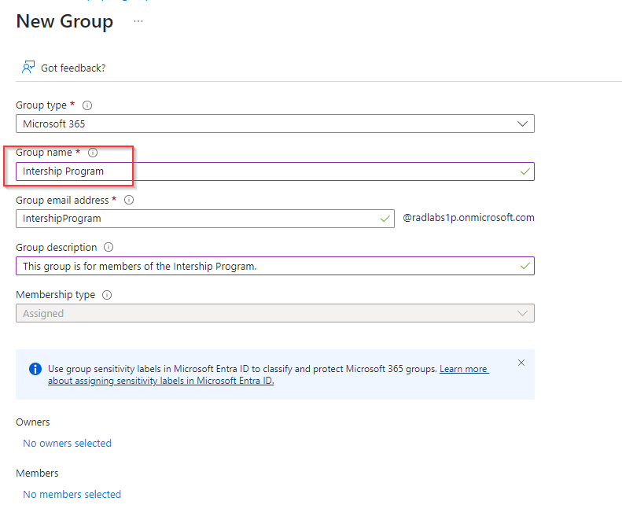

# Create a Group and Add a Member in Microsoft Entra ID

**There are 4 objectives with this lab:**
* Create a New Microsoft Entra ID Group
* Add a Microsoft Entra ID User as a Member of the Group
* Create a New Microsoft Entra ID User
* Add a Microsoft Entra ID User as an Owner of the Group

## Create a New Microsoft Entra ID Group

The first objective requires us to create a new Entra ID Group called `Internship Program` with a description of "This group is for members of the Internship Program." So lets navigate to Microsoft Entra ID using the Azure portal search function. 

Then, lets go the the Group blade on the left side.  

Once here, choose the `New Group` option at the top of the screen. 

So lets put the name and description that was given in the first line of this tutorial and click create. 

That should finish the first objective of this lab. 

## Add a Microsoft Entra ID User as a Member of the Group

For the next objective, we need to add the user `Cloud Student` to this group. So inside of the Internship Program group we just created, navigate to `Members` blade on the left. 

Once there, we're going to click `Add Members` at the top of the page and once the window on the right pops up, choose `Cloud Student` and confirm the member addition. 

Now, once you refresh the page and go to `Members`, you'll see the newly added `Cloud Student` in the list. 

Objective completed! On to the next. 

## Create a New Microsoft Entra ID User

For the 3rd task, we need to create a User called `Cloud Intern Mentor`. Lets go back to the default Microsoft Entra ID page and click on the `Users` blade on the left. 

Once there, I clicked on `New User` and chose the `Create new user` at the top of the page. 

The new user we're creating is `Cloud Intern Mentor` so I put that as the name. Dont put any spaces between the words or Azure won't accept it. You can have the original styling in the "Display Name" though. 

Click Create and you should have a new user named `Cloud Intern Mentor`.

On to the final objective!

## Add a Microsoft Entra ID User as an Owner of the Group

The last objective tasks us with adding the `Cloud Intern Mentor` to the `Internship Program` group as the `Owner`. So lets navigate back to the Internship Program. Lets now click on the `Owners` blade on the left and then click `Add owners` at the top of the page. 

Select the `Cloud Intern Mentor` and confirm the addition. They should now be listed as an Owner for the group in the `Owners` blade.

Lab completed!

## Personal Notes

Last easy lab. Extremely straightforward. 
